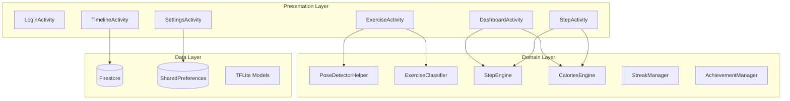
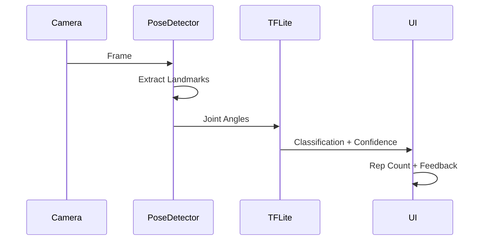

# Alignify - AI-Powered Fitness App

> Real-time exercise form correction using MediaPipe pose detection and TensorFlow Lite

---

## 📱 App Overview

Alignify is an Android fitness application that uses computer vision to analyze exercise form in real-time and provide corrective feedback. It combines AI-powered posture checking with comprehensive health tracking features comparable to Google Fit.

### Key Features
- **AI Exercise Correction**: MediaPipe PoseLandmarker + TensorFlow Lite models for real-time form analysis
- **Rep Counting & Accuracy**: Automatic repetition counting with form accuracy scoring
- **Voice & Text Feedback**: Real-time corrections during workouts
- **Step Tracking**: Background step counting with daily goals
- **Calories & Active Minutes**: Comprehensive calorie burn tracking
- **Streaks & Achievements**: 15+ unlockable badges
- **Workout History**: Complete exercise log with analytics
- **Offline-First**: Firestore persistence for seamless offline use

---

## 🏗️ Architecture



---

## 🎨 UI/UX Design System

### Color Palette
| Color | Hex | Usage |
|-------|-----|-------|
| Background | `#0D0D0D` | Main background |
| Surface | `#1A1A1A` | Card backgrounds |
| Accent | `#6C63FF` | Primary actions, highlights |
| Text Primary | `#FFFFFF` | Main text |
| Text Secondary | `#B3B3B3` | Subtle text |
| Correct Green | `#4CAF50` | Success states |
| Error Red | `#F44336` | Error states |
| Warning Yellow | `#FFC107` | Caution states |

### Typography
- **Primary Font**: System default (Roboto on Android)
- **Headings**: Bold, 20-24sp
- **Body**: Regular, 16sp
- **Caption**: Regular, 12-14sp

### Component Styles
- **Cards**: 16-20dp corner radius, elevated surfaces
- **Buttons**: Full-width with gradient backgrounds
- **Progress**: Circular and linear progress indicators

---

## 📱 Screens

### Authentication
| Screen | Description |
|--------|-------------|
| Login | Email/password + Google Sign-In |
| Signup | New user registration |
| Profile Setup | Weight, height, activity level, BMI calculation |

### Main Screens
| Screen | Description |
|--------|-------------|
| Dashboard | User profile, step tracking, streaks, quick actions |
| Exercise Selection | List of available exercises |
| Exercise (Active) | Camera view with pose overlay, rep counter, accuracy |
| History | Workout log with filtering |
| Achievements | 15+ badges with unlock status |
| Stats | Weekly/monthly charts |

### Google Fit Features
| Screen | Description |
|--------|-------------|
| StepActivity | Detailed step view with circular progress, distance, charts |
| TimelineActivity | Unified activity feed with tabs for list/charts |
| SettingsActivity | Personal data, goals, units, feedback preferences |

---

## 🔧 Technical Implementation

### Exercise Detection System


### Pose Detection Pipeline
1. CameraX provides frames at 30fps
2. MediaPipe PoseLandmarker extracts 33 body landmarks
3. Joint angles calculated (hip, knee, elbow, shoulder)
4. TensorFlow Lite model classifies pose
5. Rep counting triggered on state transitions
6. Accuracy scored against ideal form

### Step Tracking System
- **StepCounterService**: Foreground service using `TYPE_STEP_COUNTER` sensor
- **StepEngine**: Calculates distance (stride formula), active minutes
- **CaloriesEngine**: BMR (Mifflin-St Jeor) + MET-based activity calories
- **BootReceiver**: Restarts tracking after device reboot

### Exercise Models
| Exercise | Model File | Input | Output |
|----------|------------|-------|--------|
| Squat | `squat.tflite` | [12 angles] | [up, down, invalid] |
| Push-up | `pushup.tflite` | [12 angles] | [up, down, invalid] |
| Lunge | `lunge.tflite` | [12 angles] | [up, down, invalid] |
| Plank | `plank.tflite` | [12 angles] | [correct, incorrect] |

---

## 📊 Firebase Schema

```
users/{userId}/
├── profile: {name, email, weight, height, bmi, activityLevel}
├── workouts/{workoutId}: {exercise, reps, accuracy, duration, timestamp}
├── streaks: {currentStreak, lastWorkoutDate}
└── achievements/{badgeId}: {unlocked, unlockedAt}

daily_activity/{userId}/days/{date}/
├── steps: number
├── distance: number
├── calories_active: number
├── active_minutes: number
└── activities: [{type, timestamp, value}]
```

---

## 🏆 Achievement System

### Workout Badges
| Badge | Requirement |
|-------|-------------|
| First Steps | Complete 1 workout |
| Getting Started | Complete 5 workouts |
| Dedicated | Complete 25 workouts |
| Century Club | Complete 100 workouts |

### Streak Badges
| Badge | Requirement |
|-------|-------------|
| Hat Trick | 3-day streak |
| Week Warrior | 7-day streak |
| Monthly Master | 30-day streak |

### Rep Badges
| Badge | Requirement |
|-------|-------------|
| Rep Rookie | 100 total reps |
| Rep Machine | 500 total reps |
| Rep Master | 1000 total reps |

### Accuracy Badges
| Badge | Requirement |
|-------|-------------|
| Form Focus | 80% accuracy |
| Perfect Form | 90% accuracy |
| Master Form | 95% accuracy |

### Step Badges
| Badge | Requirement |
|-------|-------------|
| Walking Starter | 10,000 total steps |
| Walking Pro | 50,000 total steps |
| Walking Champion | 100,000 total steps |

---

## 📦 Dependencies

```kotlin
// Firebase
implementation("com.google.firebase:firebase-auth")
implementation("com.google.firebase:firebase-firestore")
implementation("com.google.firebase:firebase-messaging")

// ML/Vision
implementation("com.google.mediapipe:tasks-vision")
implementation("org.tensorflow:tensorflow-lite")

// UI
implementation("com.google.android.gms:play-services-auth")
implementation("com.github.PhilJay:MPAndroidChart:v3.1.0")
implementation("androidx.cardview:cardview")
implementation("androidx.constraintlayout:constraintlayout")
```

---

## 📁 Project Structure

```
app/src/main/java/com/alignify/
├── activities/
│   ├── LoginActivity.java
│   ├── SignupActivity.java
│   ├── DashboardActivity.java
│   ├── ExerciseActivity.java
│   ├── StepActivity.java
│   ├── TimelineActivity.java
│   ├── SettingsActivity.java
│   ├── AchievementsActivity.java
│   └── StatsActivity.java
├── adapter/
│   ├── TimelineAdapter.java
│   ├── WorkoutAdapter.java
│   └── AchievementAdapter.java
├── data/
│   ├── StreakManager.java
│   ├── AchievementManager.java
│   └── TimelineItem.java
├── engine/
│   ├── StepEngine.java
│   └── CaloriesEngine.java
├── service/
│   ├── StepCounterService.java
│   └── AlignifyMessagingService.java
├── receiver/
│   └── BootReceiver.java
└── util/
    ├── StepCounterHelper.java
    ├── PoseDetectorHelper.java
    └── ExerciseClassifier.java
```

---

## 🔐 Security

### Firebase Rules
- Users can only read/write their own data
- Workout timestamps validated server-side
- Profile data protected per-user

### Permissions
| Permission | Purpose |
|------------|---------|
| CAMERA | Real-time pose detection |
| ACTIVITY_RECOGNITION | Step counting |
| FOREGROUND_SERVICE | Background step tracking |
| POST_NOTIFICATIONS | Workout reminders |

---

## 🗺️ Roadmap

### ✅ MVP (Complete)
- Login/Signup with Firebase Auth
- Profile Setup with BMI
- Exercise Detection (Squat, Push-up, Lunge, Plank)
- Step Tracking

### ✅ V2 (Complete)
- Streak Tracking
- Achievement System
- Progress Charts
- FCM Notifications
- Offline Persistence

### ✅ V3 - Google Fit Features (Complete)
- StepActivity with detailed metrics
- TimelineActivity with unified activity feed
- SettingsActivity with goals/preferences
- CaloriesEngine with BMR + MET calculations
- StepEngine with distance/active minutes

### 🔮 Future
- Cloud Sync across devices
- Wearable Integration (Wear OS)
- AI Coaching with personalized plans
- Social Features (challenges, leaderboards)
